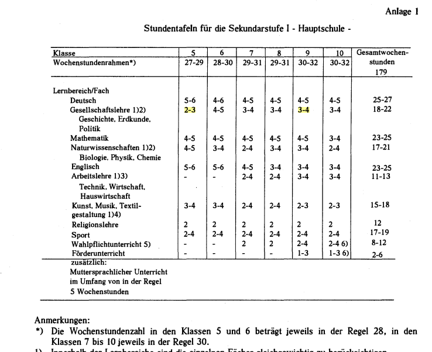
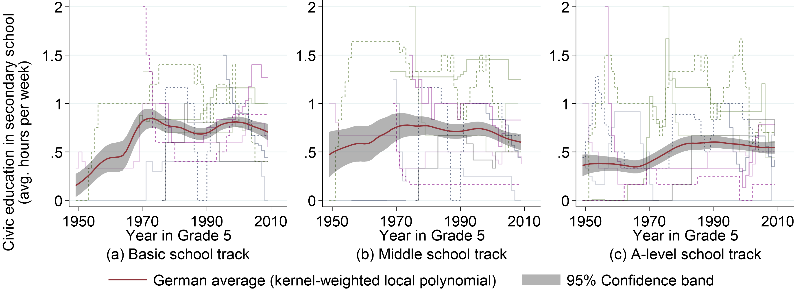
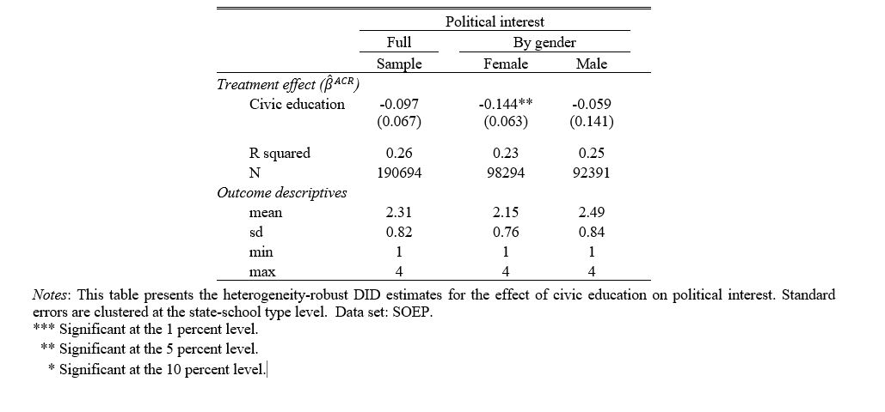
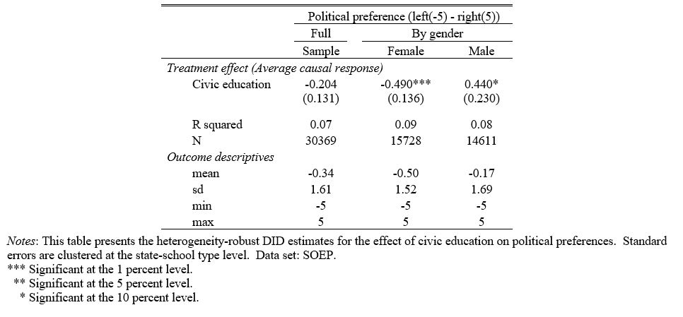

class: middle, hide-count, title-slide

<style>
.remark-slide-content{
   background-color: #FAFAFA;
  border-top: 50px solid #4C5265;
  font-weight: 300;
  line-height: 1.2;
  padding: 1.5em 1em 1em 1em
}

.remark-slide-content > h1 {
  margin-top: -75px;
}

.inverse {
  background-color: #4C5265;
  text-shadow: none;
}

/* Removes colored bar from top of the slide resulting in a clear slide */
.clear{
  border-top: 0px solid #FAFAFA;
}

.title-slide {
  background-color: #FAFAFA;
  border-top: 40px solid #FAFAFA;
  color: #000;
}

.title-slide h1  {
  color: #669999;
  font-size: 45px;
  text-shadow: none;
  font-weight: 400;
  margin-left: 15px;
  padding-top: 80px;
  letter-spacing: 0px;
}

.title-slide h2  {
  color: #669999;
  padding-bottom: -20px;
  text-shadow: none;
  font-weight: 300;
  font-size: 35px;
  text-align: left;
  margin-left: 15px;
}

.title-slide h3  {
  color: #1A292C;
  text-shadow: none;
  font-weight: 200;
  font-size: 32px;
  text-align: left;
  margin-left: 15px;
  margin-top: -25px;
  margin-bottom: -30px;
}

.title-slide h4 {
  margin-left: 15px;
  font-weight: 200;
}

.inverse h1  {
  font-size: 35px;
  text-transform: uppercase;
  letter-spacing: 2px;
}


h1 {
  font-weight: 200;
  margin-left: -00px;
  color: #FAFAFA;
}

h2 {
  color: #669999;
}

.huge {
  font-size: 150%;
}

</style>

```{r include = FALSE}
library(knitr)
library(dplyr)
library(kableExtra)
library(stargazer)
library(xtable)
library(grid)
library(gridExtra)
library(ggplot2)
library(tidyverse)
library(bookdown)
library(stargazer)
library(png)
library(icons)
library(qrcode)
library(DiagrammeR)
```

```{r xaringan-themer, include=FALSE, warning=FALSE}
library(xaringanthemer)
style_mono_accent(base_color = "#4C5265",
  base_font_size = "25px",
  header_h1_font_size = "1.2rem",
  header_h2_font_size = "1.2rem",
  header_h3_font_size = "1.15rem",
  header_font_weight = "lighter",
  header_font_google = google_font("Roboto"),
  text_font_google   = google_font("SPS local"),
  code_font_google   = google_font("IBM Plex Mono"),
  link_color = "#669999",
  text_bold_color = NULL,
  inverse_background_color = "#4C5265",
  inverse_text_color = "#ffffff",
  inverse_text_shadow = FALSE,
  inverse_link_color = "#ffffff",
  inverse_header_color = "#ffffff")
```


```{css echo=FALSE}
.hide-count .remark-slide-number {
  display: none;
}
```

```{r, caption_datatable, include=FALSE, cache=FALSE}
js <- c(
  "function(settings){",
  "  var datatable = settings.oInstance.api();",
  "  var table = datatable.table().node();",
  "  $(table).append('<caption style=\"caption-side: bottom\">' + caption + '</caption>');",
  "}"
)

xaringanExtra::use_tile_view()
```

<br>

# The Impact of Civic Education on Political Attitudes and Social Capital 
## Causal Evidence from Post-World War II Germany

<br>

### Sarah Gust, Sven Resnjanskij, Larissa Zierow, Marcel Helbig, Norbert Sendzik

#### ifo Institute, University of Munich, CESifo, and WZB Social Science Center Berlin

<br>
## ESPE 2022


<br>

---

# Motivation

## Should the government enforce that civic education is taught as a separate subject in schools?

- **Benefits:** Social returns: promotion of stable and well functioning democracy 
- **Potential costs:** Risk of a direct political influence in favor of the ruling party via the class room (Friedman 1962), opportunity costs (leisure, teaching other subject) 

--

## Research question

Is there a causal effect of mandatory civic education (taught in secondary school) on civic capital and political attitudes later in life?

---

# This Paper 

## Quasi-experimental design 
Exploit unique (West-) German setting with substantial post-war variation across German states and school types due to school reforms 

--

## Treatment
Number of hours students are exposed to civic education in school 

--

## Data

Novel database on civic education `r fontawesome::fa('plus', fill = "#669999")` German Socio-Economic Panel (GSOEP) $(N \approx 30.000)$ 


---
# Related Literature

## Political science
- Political participation depends on resources, psychological engagement with politics, and access to recruitment networks (Verba, Schlozman, and Brady 1995)

--

## Political economy
- Education affects skills and knowledge `r fontawesome::fa('long-arrow-alt-right')` reduces costs of understanding and participating in politics (Dee 2004; Bömmel, Gebel, Heineck 2020)

--

## Education and fake news 
- Education presented as important factor that can decrease dissemination of fake news (Rampersad & Althiyabi 2020; Allcot & Gentzkow 2017)

--

## Economics of education
- More recent contributions also focus on non-academic outcomes of school reforms such as personality traits (e.g., Almlund et al. (2011) and soft skills (e.g., Koch, Nafziger, and Nielsen 2015), or religious attitudes (Arold, Woessmann, and Zierow 2022)


---
# Novel database on civic education 

## Coding of all available historical legal records documenting changes in the curricula
.pull-left[
Includes …
- All major types of schools in all secondary school grades (typically 5 to 10)
- In German states after World War II

## Exposure measure for civic education
- Compulsory hours per week of civic education students have received in each cohort
- Longitudinal data set on the intensive and extensive margin of civic education]

.pull-right[
```{r, echo=FALSE, out.width = "100%",fig.show = "hold"}

```
]

---
# Large variation in the extend of civic education over birth cohorts and school types

```{r, echo=FALSE, out.width = "100%",fig.show = "hold"}

```
.tiny[
*Note:* Red line indicates the conditional average across all (equally) weighted West German states estimated by a local polynomial regression with a 95% confidence band.  Data source: Own data on civic education.
]

---
# Micro Data

## SOEP
- Match the civic education records with individual-level data from the German Socio-Economic Panel (GSOEP). 
- Contains outcome variables
- Individuals who entered primary school between 1949 and 2014
- We include only West German birth cohorts
- about 30.000 observations

## Data link between exposure to civic education and individuals
- Use of the best information available on state of schooling, school type, and school entry year
- Worst case: use birthdate information and state-time specific school entry cutoff dates

---
# Our Outcomes

## Political interest

“Generally speaking, how much are you interested in politics? Very interested, moderately interested, not much interested, or completely disinterested?” (1 to 4)

--

## Political attitude 

“In politics people often talk about "left" and "right" to mark different political attitudes. If you think about your own political attitude: Where would you place yourself?” (-5 left to 5 right)


---

# Empirical Strategy

## Estimand of Interest 

$$\beta^{ACR} = Y_{igt}(d) - Y_{igt}(d')$$

$\beta^{ACR}$: average causal response (ACR) for change in civic education from level d' to d

**Identifying assumptions**
- Strong exogeneity
- Common trends in untreated potential outcomes, $Y_{igt}(d')$
- Independent groups

---
# Constant effect TWFE model

$$y_{isptl} = \alpha + \beta d_{spt} + \mathbf{\delta'}\mathbf{x}_{isptl} + \mathbf{\gamma'}\mathbf{x}_{spt} + \tau_{sp} + \lambda_t + \theta_l + \lambda_t \times \mu_s  + \epsilon_{isptl}$$

- $i$: individual response, $s$: state, $p$: school type, $t$: cohort, $l$ survey year 
- $d_{spt}$: continous measure of civic education: varies by state $(s)$ $\times$ school type $(p)$ over cohorts $(t)$
- $x$: individual and group level controls (gender, age, parental education, party in power)
- $\tau_{sp}$ group, $\lambda_t$ cohort, and $\theta_l$ survey year FE
- $\lambda_t \times \mu_s$ non-parametric state-specific trends
--

## Heterogeneity 
- Constant-effects TWFE estimate gives a weighted average of cohort-group specific effects
- Estimating a constant-effect TWFE model if true $\beta^{ACR}$ is heterogeneous causes a problem (Wooldridge, 2021)
--

- **Solution**: Heterogeneous-effects “extended” TWFE model (eTWFE)
- If heterogeneity is modelled correctly: eTWFE is unbiased 

---
# Empirical Model

Heterogeneous-effects “extended” TWFE model (eTWFE)

$$y_{igst} = \alpha + \beta'_{isgtl} f(\tau_{sp}, \lambda, age;d) +...+ \epsilon_{igst}$$
<br>

- Estimate for average marginal effect of reform $\beta^{ACR} = n^{-1} \sum^n_{i=1}\beta_{isgtl}$
- $f(\cdot; d)$ denotes the interaction terms with treatment $d$ and the DID dimensions, varies by: cohort (in decades), age (quartic trend), state x school type

---
# Preliminary Results: Effect of civic education on political interest 

```{r, echo=FALSE, out.width = "100%",fig.show = "hold"}

```

---
# Preliminary Results: Effect of civic education on political preferences

```{r, echo=FALSE, out.width = "100%",fig.show = "hold"}

```

---
# Outlook and Conlcusion

- Strong gender differences in the effect of civic education

## Next steps

- What drives gender & cohort differences?
- Look at further outcomes: voting behavior, party identification, test data on civic
knowledge (from GLES)

---
class: middle, center, inverse

## Get in contact!

```{r include = FALSE}
qr <- qr_code("mailto:gust@ifo.de")
png(filename="img/qrplot.png")
plot(qr)
dev.off()
```

```{r, echo=FALSE, out.width = "20%",fig.show = "hold"}

```


`r fontawesome::fa('envelope', fill = "#C34A2C")` [gust@ifo.de](mailto:gust@ifo.de) 
`r fontawesome::fa('twitter', fill = "#C34A2C")` [https://twitter.com/sarages](https://twitter.com/sarages)
`r fontawesome::fa('firefox-browser', fill = "#C34A2C")` [https://www.ifo.de/en/gust-s](https://www.ifo.de/en/gust-s)

