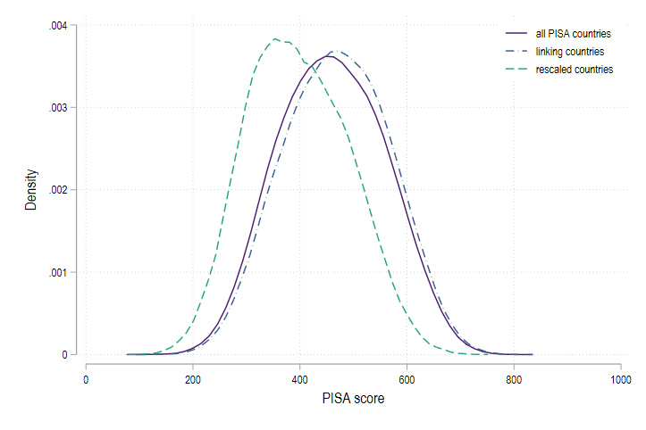
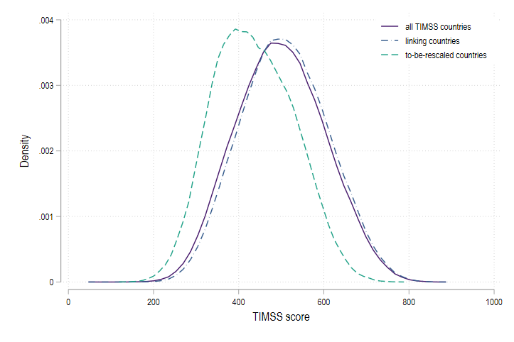
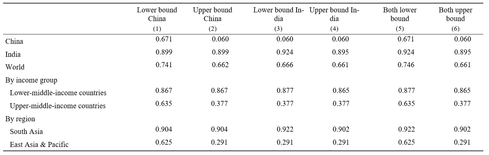

class: center, middle, hide-count

```{r include = FALSE}
library(knitr)
library(dplyr)
library(kableExtra)
library(stargazer)
library(xtable)
library(grid)
library(gridExtra)
library(ggplot2)
library(tidyverse)
library(bookdown)
library(stargazer)
library(png)
library(icons)
library(qrcode)
library(DiagrammeR)
```

```{r xaringan-themer, include=FALSE, warning=FALSE}
library(xaringanthemer)
style_mono_accent(base_color = "#728FCE",
    base_font_size = "12px",
  text_font_size = "2rem",
  code_font_size = "1.5rem",
  header_font_google = google_font("Roboto"),
  text_font_google   = google_font("Arial"),
  code_font_google   = google_font("IBM Plex Mono"),
  link_color = "#669999",
  text_bold_color = NULL,
  inverse_text_color = "#ffffff",
  inverse_text_shadow = FALSE,
  inverse_link_color = "#ffffff",
  inverse_header_color = "#ffffff")
```


```{r, load_refs, include=FALSE, cache=FALSE}
#library(RefManageR)
#BibOptions(check.entries = FALSE,
 #          bib.style = "authoryear",
  #         style= "text",
   #        hyperlink = FALSE)
#myBib <- ReadBib("gender.bib", check = FALSE)
```

```{css echo=FALSE}
.hide-count .remark-slide-number {
  display: none;
}

```

```{r, caption_datatable, include=FALSE, cache=FALSE}
js <- c(
  "function(settings){",
  "  var datatable = settings.oInstance.api();",
  "  var table = datatable.table().node();",
  "  $(table).append('<caption style=\"caption-side: bottom\">' + caption + '</caption>');",
  "}"
)

xaringanExtra::use_tile_view()
```
<br>
<br>

# Global Universal Basic Skills: Current State and Implications for World Development


<br>


.large[Sarah Gust<sup>1</sup> &nbsp;&nbsp;&nbsp; Eric A. Hanushek<sup>2</sup>  &nbsp;&nbsp;&nbsp; Ludger Woessmann<sup>3</sup>]


.footnotesize[<sup>1</sup>ifo Institute, University of Munich]
.footnotesize[<sup>2</sup>Stanford University, CESifo, IZA, NBER]
.footnotesize[<sup>3</sup>ifo Institute, University of Munich, CESifo, IZA]

<br>
IIPF Conference  

12 August 2022

<br>
<br>


---

# Motivation

.pull-left[

* Primary development goal: all youth around the world achieve at least basic skills 

* Immense importance for inclusive world development 

* Limited country coverage of previous work 
]

.pull-right[


]
---
# This Paper 

## Our research goal
1. Provide the best estimates of the share of children not achieving basic skills in all countries of the world 
2. Provide world estimate of the lost economic output due to missing the goal of global universal basic skills 

--

## Method 
- New method for linking micro data accross different international student achievement tests 
- Projections with different reform scenarios

--

## Results 

- At least 2/3 of the world’s youth do not obtain basic skills
- Achieving global universal basic skills would raise future world GDP by over 700 trillion dollars

---

class: middle, center

# 1. Constructing a Global Data Base

---
# Data

.pull-left[
- **Layer 1: PISA participants**  
  - PISA & PISA for Development
- **Layer 2: TIMSS participants** 
- **Layer 3: Participation in regional tests** 
  - PASEC (2014), SAQMEC IV (2012-2014), TERCE (2013), SERCE (2006)
- **Layer 4: Sub-territorial PISA** 
  - China and India 
- **Layer 5: No international participation** 
]

.pull-right[
 
]

---
# Method 

.content-box-blue[
### Universal Basic Skills
Fully achieving PISA Level 1 (420 points in math and 410 in science)
`r fontawesome::fa('long-arrow-alt-right')` lowest of 6 performance levels in PISA
]

---
# New Method for Linking Scores Across the Different International Tests

We convert any individual TIMSS score, $t_i$, into the corresponding PISA score, $p_i$, by:

$$p_i = \frac{(t_i - m^C_{TIMSS})}{s^C_{TIMSS}} s^C_{PISA} + m^C_{PISA}$$
We use the subset of countries, $C$, that takes the PISA test and TIMSS (or one of the different regional tests) and estimate means and standard deviations of the common countries for the two distributions.




---
# China and India

- Sub-territorial PISA participation
- **India**: Educational Initiative: Tamil Nadu scores 0.02 sd below the national mean `r fontawesome::fa('long-arrow-alt-right')` **shift the PISA distribution for Tamil Nadu to estimate the national distribution**
- **China**: Use the 2014 wave of the China Family Panel Studies (CFPS) to **re-center PISA scores** 

---
# Imputation of Achievement 

We predict the proportion of students below basic skills in country j as:

$$\rho^j = \alpha_0 + \alpha_1 E^N_j + \alpha_2 GDP_j + v_j + \mu_j + \varepsilon_j$$
where $E^N_j$ is net enrollment in secondary school, $GDP_j$ is gross domestic product per capita, and $v$ and $\mu$ are indicators for world regions and income groups, and $\epsilon$ is an error term. $R^2 = 0.835$

---
# Skill Level of Children who are not in School 

36 % of the 15-year-olds are not in school `r fontawesome::fa('long-arrow-alt-right')` how many of them are below basic skills?

- PISA-D out-of-school assessment 2018-2020
- PIAAC Data: Dropouts from upper secondary school  

**`r fontawesome::fa('long-arrow-alt-right')` We assume out-of-school kids to be on the 25th percentile of each country on average** 
and add multiple sensitivity checks

---
# Achievement of Basic Skills

 


---
class: middle, center

# 2. The Economic Gains from Global Universal Basic Skills

---

# Three Reform Scenarios

.content-box-blue[
### Scenario I 

All children who are currently in school reach at least basic skills.
]
--

.content-box-blue[
### Scenario II 

The average achievement of out-of-school children is lifted to the average achievement of in-school children in the respective country.

]
--

.content-box-blue[
### Scenario III 

Full participation in secondary school with every student attaining at least the basic skill level.
]


---
name: phases
# Four Phases of Reform

### Phase 1 (2020-2035)
Each cohort of new, higher achieving students is only a fraction of the total labour force

### Phase 2 (2036-2060)
Reform fully enacted but workers with lower level of skills in working force

### Phase 3 (2061-2075)
Labor market cohorts which only partially profited from reform are replaced with new cohorts

### Phase 4 (after 2075)
Whole workforce has gone through reform 

[Show details](#math_phases)

---
name: model

# Economic effects of this upskilling of the labor force

GDP growth: 

$$g_\tau = \gamma \bar{A_{\tau}}$$
where $\gamma$ is the estimated impact of aggregated skills on growth rates and $\bar{A_{\tau}}$ are the skills of the workforce 

--

GDP for the reform simulation over the period S: 

$$GDP_{\tau} = (1 + g_{\tau}) GDP^{t-1}_{reform}$$

Level of GDP without the reform grows at a constant rate of potential GDP, i.e., $g_{\tau} = p$

--

The total value V of the reform 

$$V = \sum^{S}_{\tau=1} (GDP^{reform}_{\tau}-GDP^{no\:reform}_{\tau}) * (1 + d)^{-\tau}$$

[Parameters](#parameters)
---
# Projection Results 

 

---
name: sensitivity 

# Sensitivity 

- Alternative parameter choices of the simulation model [show](#rb_param)
- Skill level of children who are not in school [show](#rb_skill)
- Achievement estimates of the children who are currently in school [show](#rb_skill)
- Varying uncertainty by layer [show](#rb_skill)
- Lower and upper bound for China and India [show](#rb_chn_ind)

---

# Conclusion 

## Share of children not achieving basic skills
- At least 2/3 of the world’s youth do not obtain basic skills. 
- In high-income countries, 25 % of children lack basic skills. 
- Skill deficits reach 94 % in Sub-Saharan Africa and 90 % in South Asia but also hit 70 % in Middle East and North Africa and 66 % in Latin America.

--

## Immense consequences for global economic development
- The world would gain over 700 trillion US dollars in added GDP over the remaining century if it were to reach global universal basic skills

--

## Need for an internationally standardized test
- Our analysis provides a first global picture of the distribution of skills around the world, but it comes with uncertainty.
- Half of the world’s youth live in the 35 countries that fail to participate in international tests.
- It would be a great service to world development if an international development organization were to institute a regular, internationally standardized test of representative samples of students in all countries of the global South.


---
class: middle, center, inverse

```{r include = FALSE}
qr <- qr_code("mailto:gust@ifo.de")
png(filename="img/qrplot.png")
plot(qr)
dev.off()
```

```{r, echo=FALSE, out.width = "20%",fig.show = "hold"}
include_graphics("img/qrplot.png")
```


## Get in contact!
`r fontawesome::fa('envelope', fill = "#C34A2C")` [gust@ifo.de](mailto:gust@ifo.de) 
`r fontawesome::fa('twitter', fill = "#C34A2C")` [https://twitter.com/sarages](https://twitter.com/sarages)
`r fontawesome::fa('firefox-browser', fill = "#C34A2C")` [https://www.ifo.de/en/gust-s](https://www.ifo.de/en/gust-s)

---
class: hide-count
name: math_phases

# Four Phases of Reform

## Phase 1 (2020-2035)

Each cohort of new, higher achieving students is only a fraction of the total labour force

$$\Delta^t = g * \Delta TS *\frac{1}{40} * \frac{t - 2020}{15}+ \Delta^{t-1}$$

with
- $\Delta^t =$ additional growth in GDP per capita due to reform in year $t$
- $g =$ 1.98% of additional average annual growth for a one standard deviation increase in test scores 
- $\Delta TS =$ increase in average test score due to reform
- 40 years working life
- 15 years reform duration 

---
class: hide-count

## Phase 2 (2036-2060)

Reform fully enacted but workers with lower level of skills in working force

$$\Delta^t = g * \Delta TS *\frac{1}{40}+ \Delta^{t-1}$$
--
class: hide-count

## Phase 3 (2061-2075)

Labor market cohorts which only partially profited from reform are replaced with new cohorts

$$\Delta^t = g * \Delta TS *\frac{1}{40} - (\Delta^{t-40} - \Delta^{t-41}) + \Delta^{t-1}$$
--
class: hide-count

## Phase 4 (after 2075)

Whole workforce has gone through reform 

$$\Delta^t = g * \Delta TS$$

[Go back](#phases)

---
class: hide-count
name: parameters

 

[Go back](#model)
---
class: hide-count
name: rb_param

# Sensitivity of simulation results: Alternative parameter choices

 

[Go back](#sensitivity)
---
class: hide-count
name: rb_skill

# Sensitivity of simulation results: Measurement error in skill estimates

 

[Go back](#sensitivity)

---
class: hide-count
name: rb_chn_ind

# China and India 

## China
- Beijing, Shanghai, Jiangsu and Zhejiang participated in **PISA 2018** <br>
`r fontawesome::fa('long-arrow-alt-right')` **not representative**
- **Baseline:** Use 2014 wave of the China Family Panel Studies (CFPS) to re-center PISA scores
- **Upper bound:** PISA 2018 results
- **Lower bound:** PISA 2018 results for urban population, all rural children below basic skills

## India 
- Himachal Pradesh and Tamil Nadu participated in the PISA 2009 
- **Baseline:** Educational Initiative: Tamil Nadu scores 0.02 sd below the national mean `r fontawesome::fa('long-arrow-alt-right')` **shift the PISA distribution for Tamil Nadu to estimate the national distribution** 
- **Upper bound:** unadjusted score for Tamil Nadu 
- **Lower bound:** unadjusted score for Himachal Pradesh  

---
class: hide-count

# Sensitivity of simulation results: Lower and upper bound for China and India 

 

[Go back](#sensitivity)

